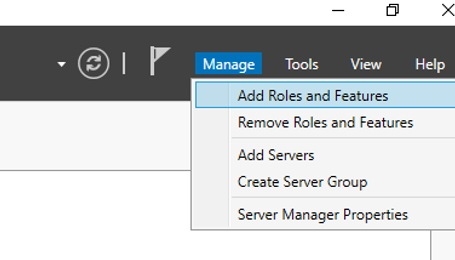
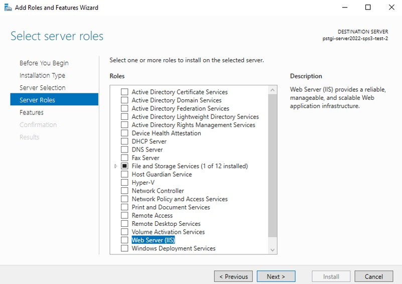
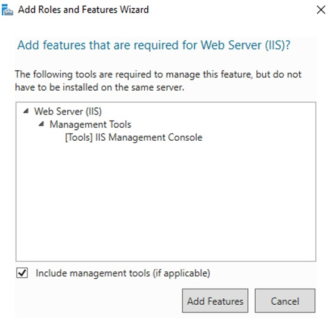
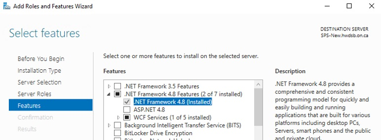
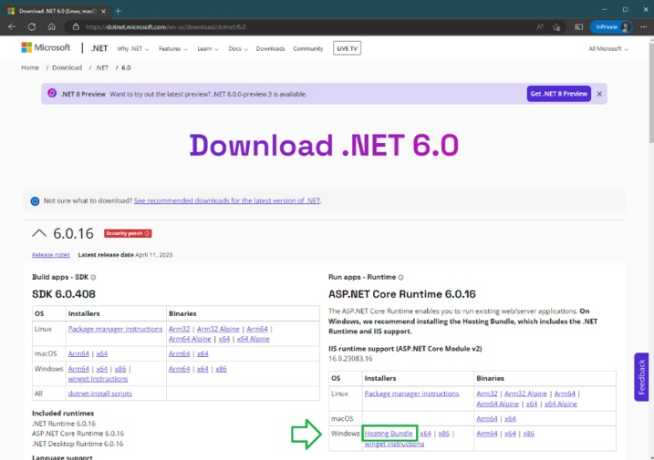
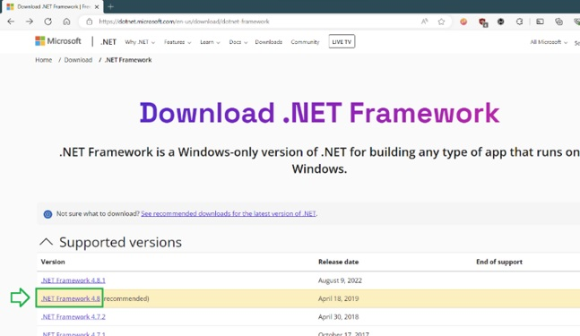

# Preparing the web server

This section describes the preparation process of a new web server, preferably a virtual machine,
where the SPS v3 application will be initially installed.

## Hardware requirements

Minimum Virtual Server requirements dedicated for only SPS v3:

| Parameter  | Minimum                                           |
|------------|---------------------------------------------------|
| CPU        | Minimum 4 virtual processors                      |
| RAM        | 16 GB                                             |
| OS Drive   | 75 GB partition for OS and components             |
| Data Drive | 100 GB partition for web apps, logs, and extracts |

## Operating System and components requirements

General requirements for Operating System

| Parameter  | Minimum                                                    |
|------------|------------------------------------------------------------|
| OS Version | Windows Server 2022 (any version) – licensed and activated |
| Web server | Internet Information Server                                |
| SQL version| Microsoft SQL Server 2019 or higher                        |

## Installing required system components

To install and run the SPS v3 web application, the server needs several components to be present.

## Installing Web Server Role

The server needs a Web Server Role installed. To add that: 
1. Open *Server Manager*
2. Click on *Manage*, then *Add Roles and Features*

    

3. When the wizard opens, click *Next>*
4. Select *Role based or feature-based installation*, then click *Next>*
5. On the *Select destination server*, choose the server you are installing the feature and click
*Next>*
6. On the *Select server roles* screen, check *Web Server (IIS)*

    

7. On the pop-up, click *Add Feature* to confirm and close the pop-up

    

8. After you go back to the previous page, click *Next>*
9. On the *Select features* screen, verify the *.NET Framework 4.8 Features > .NET Framework 4.8*
is checked and make sure it is installed.

    

    > If .NET Framework 4.8 is not available in the list, select .NET Framework 4.7 and finish the steps
in this section. Once the Role installation completes, run Windows Update on the server and install
all packages marked as required. It will upgrade .NET Framework 4.7 to a version that SPS v3 needs.
Then, come back and continue the steps in this section. Alternatively, follow the instructions in
section Confirm existence of .NET Framework 4.8 runtime below.

10. Click *Next>*
11. On the *Web Server Role (IIS)* screen, click *Next>*
12. On the *Select role services*, click *Next>*
13. On the confirmation screen, click *Install* and wait for successful finish. The process may take
a few minutes.

## Downloading and installing URL Rewrite Module 2.1

To setup the SPS v3 application, you need to install the URL Rewrite module version 2.1 on IIS.
First, download the module installer on the server from Microsoft’s IIS website. At the bottom of
the page, select the English version of the x64 installer.

 
Install the downloaded module by double-clicking the installer and following its instructions.

## Downloading and installing ASP.NET Core 6.0 Hosting Bundles

SPS v3 is developed using .NET 6.0 (LTS). To install the required runtimes, download the latest
ASP.NET Core Runtimes 6.0.x Hosting Bundles from Microsoft’s page.
 

## Confirm existence of .NET Framework 4.8 runtime

A component of the main app requires that .NET Framework 4.8 runtime be installed on the web server.
In some Windows Server versions, it may come from adding the Web Server role to the server via
Server Manager. In others, you need to install it separately.

It is recommended you download the 4.8.x version marked as “recommended” from Microsoft’s .NET
Framework website and install them on the server. 
 

When you download the file, execute it. It will tell you if the version is already installed.

These are all the steps required to prepare the server for an install SPS v3.