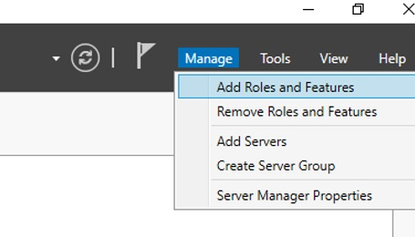
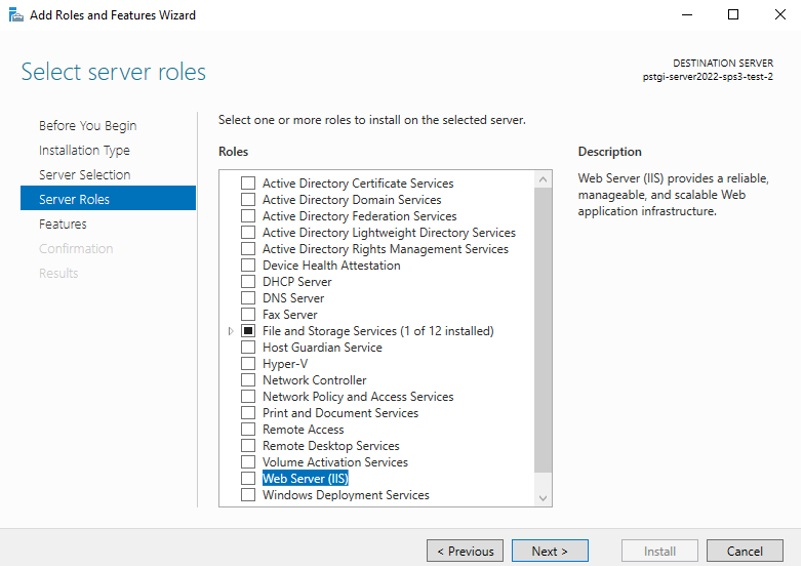
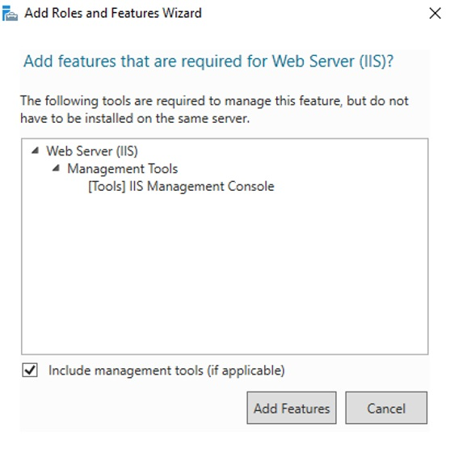
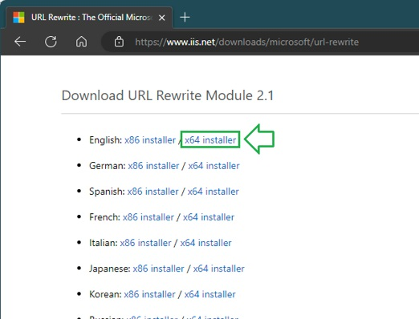
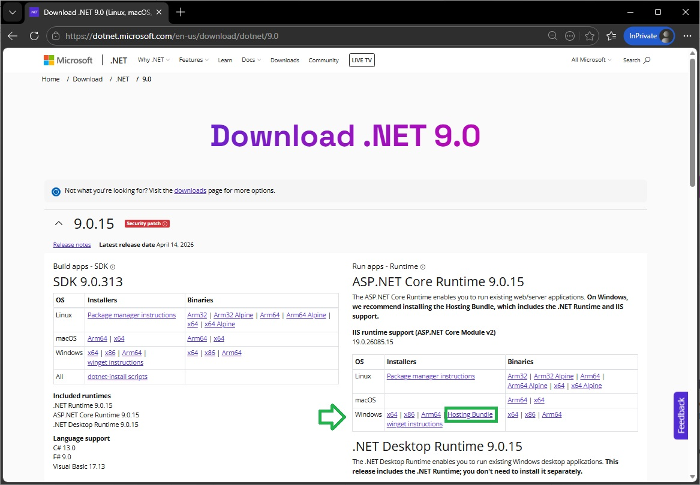

# Preparing the web server

This section describes the preparation process of a new web server, preferably a virtual machine,
where the SPS Plus application will be initially installed.

## Hardware requirements

Minimum Virtual Server requirements dedicated for only SPS Plus:

| Parameter  | Minimum                                           |
|------------|---------------------------------------------------|
| CPU        | Minimum 4 virtual processors                      |
| RAM        | 16 GB                                             |
| OS Drive   | 75 GB partition for OS and components             |
| Data Drive | 100 GB partition for web apps, logs, and extracts |

## Operating System and components requirements

General requirements for Operating System

| Parameter  | Minimum                                                    |
|------------|------------------------------------------------------------|
| OS Version | Windows Server 2022 (any version) - licensed and activated |
| Web server | Internet Information Server                                |
| SQL version| Microsoft SQL Server 2019 or higher                        |

## Installing required system components

To install and run the SPS Plus web application, the server needs several components to be present.

## Installing Web Server Role

The server needs a Web Server Role installed. To add that: 
1. Open *Server Manager*
2. Click on *Manage*, then *Add Roles and Features*

    

3. When the wizard opens, click *Next>*
4. Select *Role based or feature-based installation*, then click *Next>*
5. On the *Select destination server*, choose the server you are installing the feature and click
*Next>*
6. On the *Select server roles* screen, check *Web Server (IIS)*

    

7. On the pop-up, click *Add Feature* to confirm and close the pop-up

    

8. After you go back to the previous page, click *Next>*
9. Click *Next>*
10. On the *Web Server Role (IIS)* screen, click *Next>*
11. On the *Select role services*, click *Next>*
12. On the confirmation screen, click *Install* and wait for successful finish. The process may take
a few minutes.

## Downloading and installing URL Rewrite Module 2.1

To setup the SPS Plus application, you need to install the URL Rewrite module version 2.1 on IIS.
Visit the [official web page](https://www.iis.net/downloads/microsoft/url-rewrite) containing the
module installer on the server from Microsoft's IIS website. At the bottom of the page, select 
the English version of the x64 installer.

 
Install the downloaded module by double-clicking the installer and following its instructions.

## Downloading and installing ASP.NET Core 9.0 Hosting Bundles

SPS Plus is developed using .NET 9.0 (LTS). To install the required runtimes, download the latest
release of [ASP.NET Core Runtimes 9 Hosting Bundles](https://dotnet.microsoft.com/en-us/download/dotnet/9.0)
from Microsoft's website.

> WARNING! Downloading any other major version will not work with the SPS Plus application.
 

These are all the steps required to prepare the server for an install SPS Plus.

___

[Home](../README.md) / Next: [Setting up IIS websites for the first time](./setting-up-iis-websites-for-the-first-time.md)
