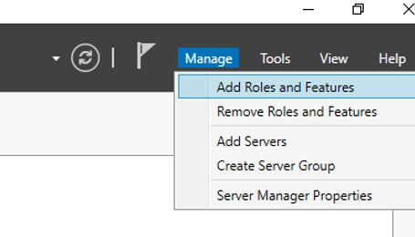
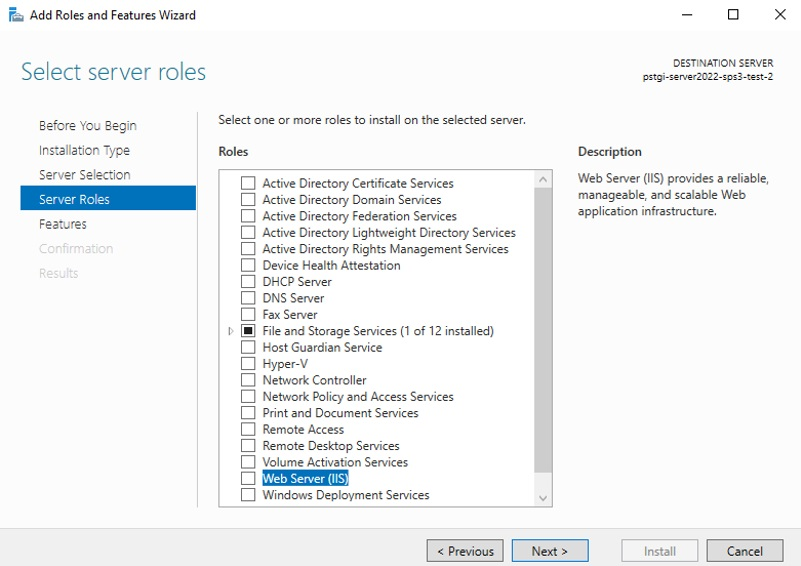
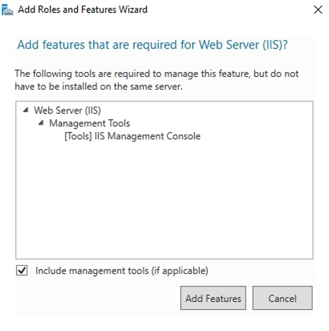
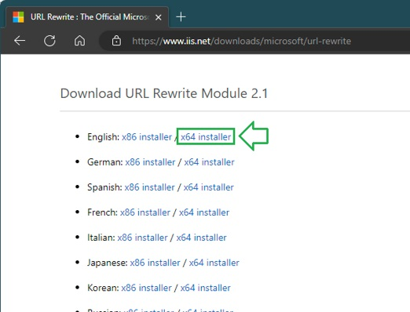

# Requirements and Installation of SPS v3

This document describes administrative tasks related to installing and maintaining an instance of
the SPS v3 web application. It contains instructions about three distinct tasks related to SPS+
v3 web servers. They are separated in three sections:

## Contents

- [Preparing the web server](#preparing-the-web-server)
- [Setting up IIS websites for the first time](#setting-up-iis-websites-for-the-first-time)
- [Updating the SPS v3 application](#updating-the-sps-v3-application)

In most cases, the first two sections of this document need to be performed only once – and only
when setting up a new server. On an existing server that already runs SPS v3, you need to follow
the instructions for updating to a new version in the last sections.

## Preparing the web server

This section describes the preparation process of a new web server, preferably a virtual machine,
where the SPS v3 application will be initially installed.

### Hardware requirements

Minimum Virtual Server requirements dedicated for only SPS v3:

| Parameter  | Minimum                                           |
|------------|---------------------------------------------------|
| CPU        | Minimum 4 virtual processors                      |
| RAM        | 16 GB                                             |
| OS Drive   | 75 GB partition for OS and components             |
| Data Drive | 100 GB partition for web apps, logs, and extracts |

### Operating System and components requirements

General requirements for Operating System

| Parameter  | Minimum                                                    |
|------------|------------------------------------------------------------|
| OS Version | Windows Server 2022 (any version) – licensed and activated |
| Web server | Internet Information Server                                |
| SQL version| Microsoft SQL Server 2019 or higher                        |

### Installing required system components

To install and run the SPS v3 web application, the server needs several components to be present.

### Installing Web Server Role

The server needs a Web Server Role installed. To add that: 
1.	Open *Server Manager*
2.	Click on *Manage*, then *Add Roles and Features*

3.	When the wizard opens, click *Next>*
4.	Select *Role based or feature-based installation*, then click *Next>*
5.	On the *Select destination server*, choose the server you are installing the feature and click
*Next>*
6.	On the *Select server roles* screen, check *Web Server (IIS)*

7.	On the pop-up, click *Add Feature* to confirm and close the pop-up

8.	After you go back to the previous page, click *Next>*
9.	On the *Select features* screen, verify the *.NET Framework 4.8 Features > .NET Framework 4.8*
is checked and make sure it is installed.

> If .NET Framework 4.8 is not available in the list, select .NET Framework 4.7 and finish the steps
in this section. Once the Role installation completes, run Windows Update on the server and install
all packages marked as required. It will upgrade .NET Framework 4.7 to a version that SPS v3 needs.
Then, come back and continue the steps in this section. Alternatively, follow the instructions in
section Confirm existence of .NET Framework 4.8 runtime below.

10.	Click *Next>*
11.	On the *Web Server Role (IIS)* screen, click *Next>*
12.	On the *Select role services*, click *Next>*
13.	On the confirmation screen, click *Install* and wait for successful finish. The process may take
a few minutes.

### Downloading and installing URL Rewrite Module 2.1

To setup the SPS v3 application, you need to install the URL Rewrite module version 2.1 on IIS.
First, download the module installer on the server from Microsoft’s IIS website. At the bottom of
the page, select the English version of the x64 installer.

 
Install the downloaded module by double-clicking the installer and following its instructions.

### Downloading and installing ASP.NET Core 6.0 Hosting Bundles

SPS v3 is developed using .NET 6.0 (LTS). To install the required runtimes, download the latest
ASP.NET Core Runtimes 6.0.x Hosting Bundles from Microsoft’s page.
 

### Confirm existence of .NET Framework 4.8 runtime

A component of the main app requires that .NET Framework 4.8 runtime be installed on the web server.
In some Windows Server versions, it may come from adding the Web Server role to the server via
Server Manager. In others, you need to install it separately.

It is recommended you download the 4.8.x version marked as “recommended” from Microsoft’s .NET
Framework website and install them on the server. 
 

When you download the file, execute it. It will tell you if the version is already installed.

These are all the steps required to prepare the server for an install SPS v3.?

## Setting up IIS websites for the first time

The following are instructions on how to setup IIS for a new instance of the SPS v3 application on
a new server. Please do not proceed with these steps if you did not complete the previous section,
Preparing the web server of this document. If you already have SPS v3 installed on your server,
you do not need to perform any of these steps.

### Create two websites in IIS

The application has a front-end and a back-end component. Each needs a separate website in IIS.

#### Create an IIS website for API component

Create a new folder SPS v3 - API under your root IIS folder (usually C:\inetpub\wwwroot\SPS v3).
This will be the destination root folder of the SPS v3 application.

Open IIS Manager, in the tree on the left, right-click Sites, then choose Add Website. In the modal
popup, enter:
- Site name: *SPS v3 - API*
- Physical path: *browse to the destination root folder you have created*
- Port: *44301* \*
- Start website immediately: *unchecked*

Leave the rest of the fields with their default values and click OK.

If you will be using only a specific URL, set it in the Host name field. This will allow you to
access the API server using a specific URL and change the port as needed.

---
\* Port 44301 is required by the front-end component to connect to the API server application. 
If you need to change it, please contact PSTGI support for assistance on how to setup the proper
connectivity. Alternatively, you can use the same port as the front-end application, but you will
need a different Host name for the API server.

##### Set application pool idle timeout

To prevent the app from shutting down due to inactivity, you need to set the idle timeout of the
application pool to 0. In IIS Manager, find the Application Pool with the same name. It is located 
in the tree on the left under Application Pools. Right-click on it and choose Advanced Settings.
In the modal popup, find the Idle Time-out (minutes) field and set it to 0. This will prevent the 
application from shutting down due to inactivity.

#### Create a website for the front-end application

Before you begin, we suggest stopping or removing the Default Web Site from your IIS. This will
allow you to use default port 80 to access the SPS v3 front-end application. If you cannot do that,
we suggest setting port 4200 for the front-end application.

In *IIS Manager*, right-click *Sites*, then choose *Add Website*. In the modal popup, enter:
- Site name: *SPS v3 - Web App*
- Physical path: *{destination_root_folder}\wwwroot\dist*
- Port: *80*
- Start website immediately: *unchecked*

If you will be using only a specific URL, set it in the Host name field. This will allow you to
access the API server using a specific URL.

Leave the rest of the fields with their default values and click OK.

 
At this point, you will have the two websites setup properly.

### Firewall setup

Add inbound exception in the firewall of the server for TCP port 44301, where the API server is
accessed. To do so, open Windows Defender Firewall and Advanced Security from Windows and add an
Inbound Rule. Name it “PSTGI SPS v3 API server” for easy recognition. Allow traffic to the types of
networks you intend to use SPS v3 on.

These are all the steps needed to be configured on the server for SPS v3 to work properly.

## Updating the SPS v3 application

This section describes the process of updating an existing instance of the SPS v3 application,
which is already running on a web server, to its latest version.

If you do not have an instance of the SPS v3 web application running on the web server, you need
to perform the tasks in [Preparing the web server](#preparing-the-web-server) and 
[Setting up IIS websites for the first time](#setting-up-iis-websites-for-the-first-time) sections
above.

### Download the application files

Download the latest distributable file from the location given to you by PSTGI or request it from
the support team. The application will come as a single ZIP file. It will contain all needed files
except the setting files that configure the application for your needs, such as

- \appsettings.json
- \log4net.config
- \wwwroot\dist\assets\appconfig.json

> The settings files should be kept from your original deployment. If any changes are necessary,
you would have received instructions on how to modify your setting files with the new distributable.

Locate the destination folder of the original deployment. Usually, it is the API website created in
the IIS of that server. The default location is C:\inetpub\wwwroot\SPS v3. Make a note of this path
as it will be required in other steps below.

> When you install the application for the first time, you may have had to create a folder */App_Data*
and set full permissions for the IIS_IUSRS group on that folder. This is where the application logs
and some temporary files will be stored.

### Deploy the new version of the application

Before you start, backup all existing files and subfolders in the original deployment folder.
Although the application has two websites created in IIS, it is a single folder, with a subfolder
for the front-end component. It is enough to backup the folder which SPS v3 - API website points to.

Stop the two websites – SPS v3 - API and SPS v3 - Web App from IIS before you continue.

Delete all files and subfolders from the location of the original deployment, but keep */APP_DATA*
folder to avoid having to set the permissions for that folder again.

Unzip all files and subfolders from the downloaded distributable in a temporary folder. After the
unzip operation completes, movr all files and folders to the same destination folder, where you had
the original files.

> The contents of the distributable ZIP file will not contain the setting files needed to configure
the application to run on your specific server and network.

The original backup folder on your server (usually *D:\Backups\SPS v3 Backup\App Settings Backup*)
would contain the original versions of all setting files within a proper folder structure. 

You can
copy the content of this folder directly inside the root folder of your installation. The files
will go to their proper locations - two in the root of the web app and one in a subfolder 
*.\wwwroot\dist*.

Start the two websites from your IIS. After a few seconds, you can check if the SPS v3 application
is running properly. 

Loading of the first page after a restart will take longer than usual (up to a minute).

- Test any functionality you usually use and if something does not look proper, please contact PSTGI’s Customer Support. 
- Check the log files located in \App_Data\Logs folder for any errors.
