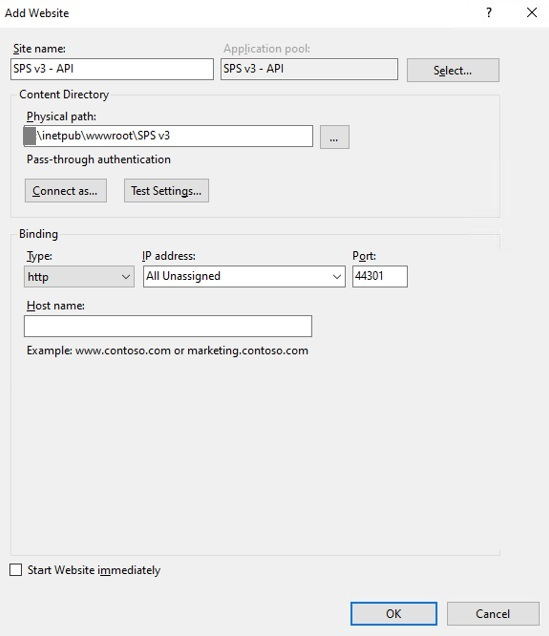
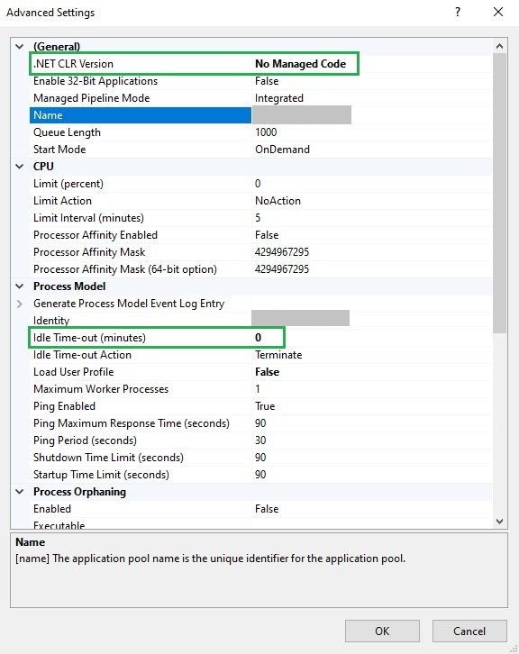
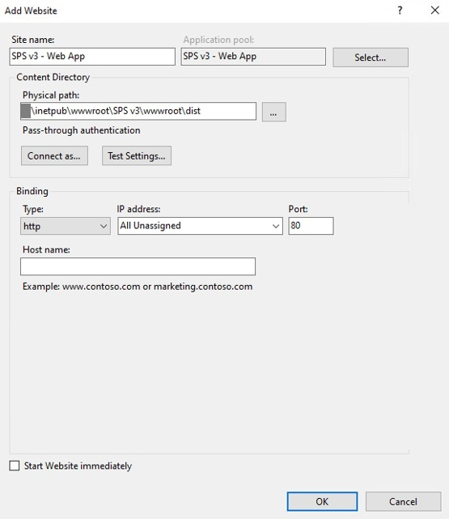

# Setting up IIS websites for the first time

The following are instructions on how to setup IIS for a new instance of the SPS v3 application on
a new server. Please do not proceed with these steps if you did not complete the previous section,
Preparing the web server of this document. If you already have SPS v3 installed on your server,
you do not need to perform any of these steps.

## Create two websites in IIS

The application has a front-end and a back-end component. Each needs a separate website in IIS.

> These instructions demonstrate the configuration of SPS v3 for using it with the HTTP protocol. 
You can configure the HTTPS protocol during this process, by providing an SSL certificate already 
be installed on the server. You can configure the HTTPS while following these instrustions or at a 
later time by checking [Configuring HTTPS protocol for SPS v3](./configuring-https-protocol.md).

### Create an IIS website for API component

> We suggest setting up the website files on the secondary drive of the server. This will allow
you to have more space for the application files and logs, prevent the primary drive from filling up,
and allow easier upgrade of the operating system.

Create a new folder SPS v3 - API under your root IIS folder (usually D:\inetpub\wwwroot\SPS v3).
This will be the destination root folder of the SPS v3 application.

Open IIS Manager, in the tree on the left, right-click Sites, then choose Add Website. In the modal
popup, enter:
- Site name: *SPS v3 - API*
- Physical path: *browse to the destination root folder you have created*
- Port: *44301* \*
- Start website immediately: *unchecked*

Leave the rest of the fields with their default values and click OK.

If you will be using only a specific URL, set it in the Host name field. This will allow you to
access the API server using a specific URL and change the port as needed.

---
\* Port 44301 is required by the front-end component to connect to the API server application. 
If you need to change it, please contact PSTGI support for assistance on how to setup the proper
connectivity. Alternatively, you can use the same port as the front-end application, but you will
need a different Host name for the API server.

#### Set application pool parameters

To prevent the back-end app from shutting down due to inactivity, you need to set the idle timeout 
of the application pool to 0. In IIS Manager, find the Application Pool with the same name. It is 
located in the tree on the left under Application Pools. Right-click on it and choose Advanced Settings.
In the modal popup, find the Idle Time-out (minutes) field and set it to 0. This will prevent the 
application from shutting down due to inactivity.

Also, change the .NET CLR Version value to *No Managed Code*. This is optional, but is recommended as
the app does not rely on loading the desktop CLR (.NET CLR).

### Create a website for the front-end application

Before you begin, we suggest stopping or removing the Default Web Site from your IIS. This will
allow you to use default port 80 to access the SPS v3 front-end application. If you cannot do that,
we suggest setting port 4200 for the front-end application.

In *IIS Manager*, right-click *Sites*, then choose *Add Website*. In the modal popup, enter:
- Site name: *SPS v3 - Web App*
- Physical path: *{destination_root_folder}\wwwroot\dist*
- Port: *80*
- Start website immediately: *unchecked*

If you will be using only a specific URL, set it in the Host name field. This will allow you to
access the API server using a specific URL.

Leave the rest of the fields with their default values and click OK.

 
At this point, you will have the two websites setup properly.

## Firewall setup

Add inbound exception in the firewall of the server for TCP port 44301, where the API server is
accessed. To do so, open Windows Defender Firewall and Advanced Security from Windows and add an
Inbound Rule. Name it *PSTGI SPS v3 API server* for easy recognition. Allow traffic to the types of
networks you intend to use SPS v3 on.

These are all the steps needed to be configured on the server for SPS v3 to work properly.

___

[Home](../README.md) / Next: [Setting up the network share](./setting-up-network-share.md)
