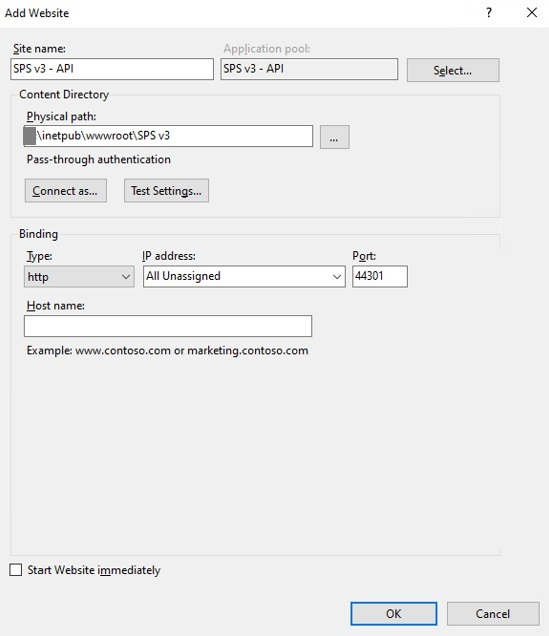
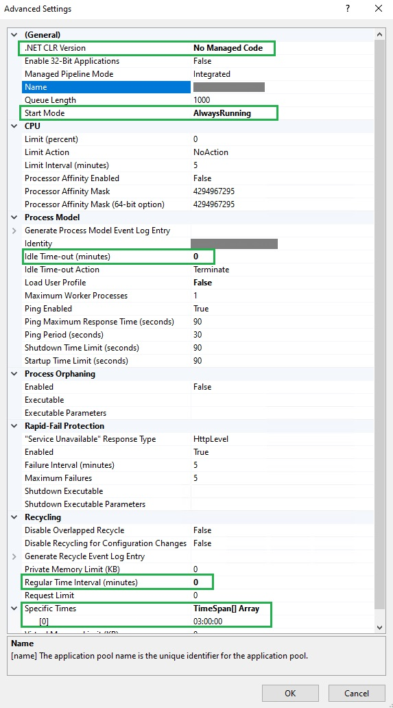
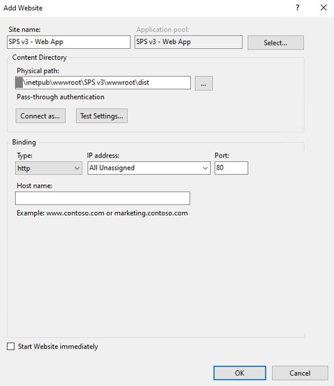

# Setting up IIS websites for the first time

The following are instructions on how to setup IIS for a new instance of the SPS Plus application on
a new server. Please do not proceed with these steps if you did not complete the previous section,
Preparing the web server of this document. If you already have SPS Plus installed on your server,
you do not need to perform any of these steps.

## Create two websites in IIS

The application has a front-end and a back-end component. Each needs a separate website in IIS.

> These instructions demonstrate the configuration of SPS Plus for using it with the HTTP protocol. 
You can configure the HTTPS protocol during this process, by providing an SSL certificate already 
be installed on the server. You can configure the HTTPS while following these instructions or at a
later time by checking [Configuring HTTPS protocol for SPS Plus](./configuring-https-protocol.md).

### Create an IIS website for API component

> We suggest setting up the website files on the secondary drive of the server. This will allow
you to have more space for the application files and logs, prevent the primary drive from filling up,
and allow easier upgrade of the operating system.

Create a new folder SPS Plus - API under your root IIS folder (usually D:\inetpub\wwwroot\SPS Plus).
This will be the destination root folder of the SPS Plus application.

Open IIS Manager, in the tree on the left, right-click Sites, then choose Add Website. In the modal
popup, enter:
- Site name: *SPS Plus - API*
- Physical path: *browse to the destination root folder you have created*
- Port: *44301* \*
- Start website immediately: *unchecked*

Leave the rest of the fields with their default values and click OK.

If you will be using only a specific URL, set it in the Host name field. This will allow you to
access the API server using a specific URL and change the port as needed.

---
\* Port 44301 is required by the front-end component to connect to the API server application. 
If you need to change it, please contact PSTGI support for assistance on how to setup the proper
connectivity. Alternatively, you can use the same port as the front-end application, but you will
need a different Host name for the API server.



#### Set application pool parameters (recommended)

The back-end application may take a long time to initialize at first visit. With the default IIS
settings, the application is only started when the first request arrives, so the first user after a
restart, recycle, or period of inactivity has to wait for the full startup. The settings below make
IIS keep the application running and warm it up automatically in the background, so users never
experience the slow first request.

> The following may increase the use of energy and memory on the server, but it is recommended 
for a better user experience.

First, install the *Application Initialization* feature of IIS, if it is not installed already. Open
Server Manager, choose Add Roles and Features, and under Web Server (IIS) > Web Server >
Application Development, check *Application Initialization*. Alternatively, run the following
command in an elevated PowerShell:

```powershell
Install-WindowsFeature Web-AppInit
```

Then, in IIS Manager, find the Application Pool with the same name as the API website - usually 
SPS Plus - API. It is located in the tree on the left under Application Pools. Right-click on it 
and choose Advanced Settings. In the modal popup, set:

- **Start Mode**: *AlwaysRunning* — IIS starts the application immediately after a recycle or a
server restart, instead of waiting for the first request.
- **Idle Time-out (minutes)**: *0* — prevents the application from shutting down due to inactivity.
- **Regular Time Interval (minutes)** (under Recycling): *0* — disables the default recycle that
occurs every 29 hours at unpredictable times. Optionally, set **Specific Times** to a quiet hour
(for example *03:00:00*) to recycle the application once a day instead.
- **.NET CLR Version**: *No Managed Code* — optional, but recommended as the app does not rely on
loading the desktop CLR (.NET CLR).

Finally, enable warmup on the API website itself. In the tree on the left, select the *SPS Plus - API*
website, click Advanced Settings in the Actions pane on the right, and set **Preload Enabled** to
*True*. With this setting, whenever the application pool starts, IIS immediately sends a warmup
request to the application, so the slow initialization happens in the background instead of on the
first user request.

To verify the setup, restart the application pool without opening the website, wait about a minute,
then open the website — it should load within a few seconds. You can also check in Task Manager that
a *w3wp.exe* process for the API application pool is running even though no one has accessed the site.

Also, change the .NET CLR Version value to *No Managed Code*. This is optional, but is also recommended 
as the app does not rely on loading the desktop CLR (.NET CLR).



### Create a website for the front-end application

Before you begin, we suggest stopping or removing the Default Web Site from your IIS. This will
allow you to use default port 80 to access the SPS Plus front-end application. If you cannot do that,
we suggest setting port 4200 for the front-end application.

In *IIS Manager*, right-click *Sites*, then choose *Add Website*. In the modal popup, enter:
- Site name: *SPS Plus - Web App*
- Physical path: *{destination_root_folder}\wwwroot\dist*
- Port: *80*
- Start website immediately: *unchecked*

If you will be using only a specific URL, set it in the Host name field. This will allow you to
access the API server using a specific URL.

Leave the rest of the fields with their default values and click OK.


 
At this point, you will have the two websites setup properly.

## Firewall setup

Add inbound exception in the firewall of the server for TCP port 44301, where the API server is
accessed. To do so, open Windows Defender Firewall and Advanced Security from Windows and add an
Inbound Rule. Name it *PSTGI SPS Plus API server* for easy recognition. Allow traffic to the types of
networks you intend to use SPS Plus on.

These are all the steps needed to be configured on the server for SPS Plus to work properly.

___

[Home](../README.md) / Next: [Setting up the network share](./setting-up-network-share.md)
