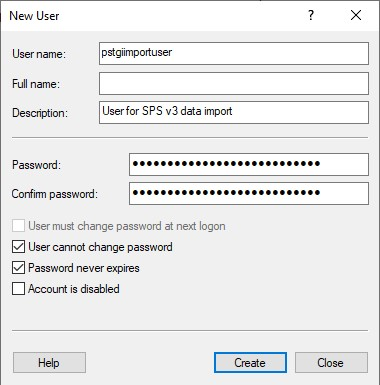
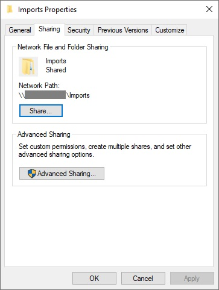
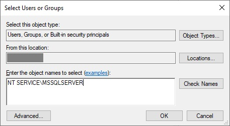
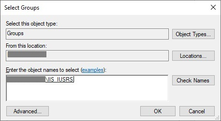
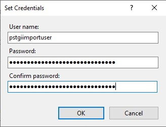
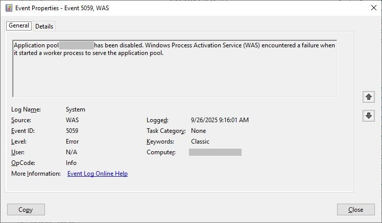
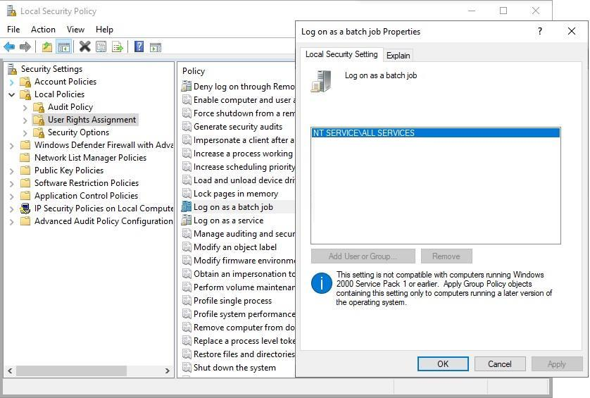

# Set up network share

> If you have upgraded an existing SPS 1.0 to SPS v3, you may already have a network share
set up. If you do, you do not need to perform these steps unless you have migrated your SQL
server used for SPS 1.0 to a new instance. You may also want to create a new network share
that will be used in both SPS 1.0 and SPS v3 to fix security issues that may have been present
in the old network share.

For the data import feature to work, SPS v3 needs to have access to a network share - a folder 
that is on any hard drive of the SQL server made accessible by network users. This network share
is where the data files are uploaded for access by the SQL server.

> The recommended location of the network share is on the SQL server itself. These
instructions assume that the network share is on the SQL server.

## Creating user accounts

To set up the network share, you need to create two user accounts: one for the SQL server
and one for the web app server.

### Creating user on the SQL server

> The following instructions are created based on Windows Server 2019. The steps may vary
slightly depending on the version of Windows Server you are using.

1. In the Windows Start menu, find Computer Management and open it.
1. In the three on the left, expand *Local Users and Groups* and select *Users*.
1. In the panel on the right, click *More Actions* and select *New User*.
1. For the User name, enter *pstgiimportuser*.
1. For Description, enter *User for SPS v3 data import*.
1. For password enter a complex password and confirm it. Remember it as you will need it for the web app server.
1. Uncheck *User must change password at next logon*.
1. Check *User cannot change password*.
1. Check *Password never expires*.
1. Click *Create*.

    

1. Click *Close* to close the pop up window.

#### Assigning the network user to the network share

The SPS v3 expects to be able to store and retrieve files from the network share. To allow
this, you need to assign the user you just created to the network share.

1. Select a location on a hard drive of the SQL server where you want to create a share folder.
1. Create a new folder and name it */Imports*.
1. Right-click on the folder and select *Properties*.
1. Click on the *Sharing* tab.
1. Click the *Share* button.
1. In the input field, enter *pstgiimportuser* and click *Add*.
1. In the list of users below, click on the *pstgiimportuser* user and select *Read/Write* as permission level.
1. Click *Share* to close the window.
1. Click *Done* to close the next window.

Make a note of the network path to the folder. It should be something like `\\<server-name>\Imports`.
You will need it to set it up in the SPS v3 System Configuration.

#### Assigning the SQL SERVER user to the network share

The SQL server needs to have access to the network share to read the files. To allow this,
you need to give *Read-only* permission to that folder and its subfolders. 

1. Right-click on the */Imports* folder and select *Properties*.
1. Select the "Security" tab.
1. Click *Edit* located under the top list.
1. On the *Permissions for Imports* pop-up, click *Add*.
1. Make sure that the name of the local server is selecred in the *From this location*.
1. In the *Enter object name to select* enter *NT SERVICE\MSSQLSERVER* or *NT SERVICE\MSSQL$xxx*, where *xxx* is your SQL instance name.
1. Click *Check Names* button. If you see another pop-up, select the name and click *OK*.

    

1. Click *OK* to close the *Select Users or Groups* pop-up.
1. Make sure that on the *Imports Properties* pop-up, the user is selected and has *Read & execute* permission checked.

    

1. Click *OK* to close the *Imports Properties* pop-up.

For more information, check [Microsoft's SQL Server documentation](https://learn.microsoft.com/en-us/sql/database-engine/configure-windows/configure-file-system-permissions-for-database-engine-access).

With this, you have set up the network share on the SQL server. The SQL server can read the files
and the *pstgiimportuser* can write files to the network share.

> **IMPORTANT!**
> The path to the network share you created must be set in the SPS v3 System Configuration before 
you can import any data. Set it after the application is installed and configured. For that, login 
to SPS v3 as an administrator and go to *Administration* > *SPS Setup* > *System Configuration* and 
set the path in the *Import Folder* field.

### Creating user on the web app server

The web app server needs to have access to the network share to upload files. To allow this,
you need to create a user with the same username and password as the user on the SQL server.
Then, you need to set the App Pool of the *SPS v3 - API* to run as this user.

To create the new user on the web app server, follow these steps:

1. In the Windows Start menu, find Computer Management and open it.
1. In the three on the left, expand *Local Users and Groups* and select *Users*.
1. In the panel on the right, click *More Actions* and select *New User*.
1. For the User name, enter *pstgiimportuser*.
1. For Description, enter *User for SPS v3 data import*.
1. For password enter the same password you used on the SQL server.
1. Uncheck *User must change password at next logon*.
1. Check *User cannot change password*.
1. Check *Password never expires*.
1. Click *Create*.

    

1. Click *Close* to close the pop up window.

To add the user to the *IIS_IUSRS* group, follow these steps:

1. Double-click the user you just created.
1. Go to the *Member of* tab.
1. Click *Add*.
1. In the *Enter the object names to select* field, enter *IIS_IUSRS* and click *Check Names*.
1. The group should be found and displayed. Click *OK*.

At this point, you should have a user with the same username and password on both the SQL server.
It would also be a member of the *IIS_IUSRS* group, which will allow it to run the SPS v3 backend.

#### Assigning user to the App Pool

1. Open IIS Manager.
1. From *Sites*, stop the *SPS v3 - API* website, if it is running.
1. In *Application Pools*, right-clixk *SPS v3 - API* and select *Advanced Settings*.
1. Find the *Identity* field and click the *...* button.
1. Choose *Custom account*, then click *Set*.
1. Enter the username and password you have created with the steps above.
1. Click *OK* to close the window and set the changes.
1. In the IIS Manager, click *Recycle* to restart the App Pool.
1. In the *Sites* section, start the *SPS v3 - API* website.

> For SPS 1.0 to use the same import process and folders, you need to set the same user and 
password in the SPS 1.0 website on IIS > Advanced settings > *Physical Path Credentials* property.

At this point, you should have a folder on the SQL server that is shared on the network 
and that the web app server can access using the user account you created.

## Troubleshooting

### Application pools stopping

If the Application Pool stops by itself after you set the custom user, check for errors in Event Viewer >
Windows Logs > System. You may see errors like "Windows Process Activation Service (WAS) encountered a failure 
when it started a worker process to serve the application pool". 

It usually means that the user you set does not have the permission to log in as a batch job (non-interactive
login). To fix this, follow these steps:

1. In the *Windows Start* menu, find *Local Security Policy* and open it.
1. Go to *Local Policies* > *User Rights Assignment*.
1. Find *Log on as a batch job* and double-click it.
1. Add the *pstgiimportuser* user you created to the list.

___

[Home](../README.md) / Next: [Updating the SPS v3 application](./updating-the-sps-v3-application.md)
