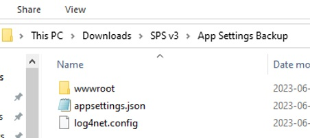

# Updating the SPS v3 application

This section describes the process of updating an existing instance of the SPS v3 application,
which is already running on a web server, to its latest version.

If you do not have an instance of the SPS v3 web application running on the web server, you need
to perform the tasks in [Preparing the web server](#preparing-the-web-server) and 
[Setting up IIS websites for the first time](#setting-up-iis-websites-for-the-first-time) sections
above.

## Download the application files

Download the latest distributable file from the location given to you by PSTGI or request it from
the support team. The application will come as a single ZIP file. It will contain all needed files
except the setting files that configure the application for your needs, such as

- \appsettings.json
- \log4net.config
- \wwwroot\dist\assets\appconfig.json

> The settings files should be kept from your original deployment. If any changes are necessary,
you would have received instructions on how to modify your setting files with the new distributable.

Locate the destination folder of the original deployment. Usually, it is the API website created in
the IIS of that server. The default location is C:\inetpub\wwwroot\SPS v3. Make a note of this path
as it will be required in other steps below.

> When you install the application for the first time, you may have had to create a folder */App_Data*
and set full permissions for the IIS_IUSRS group on that folder. This is where the application logs
and some temporary files will be stored.

## Deploy the new version of the application

Before you start, backup all existing files and subfolders in the original deployment folder.
Although the application has two websites created in IIS, it is a single folder, with a subfolder
for the front-end component. It is enough to backup the folder which SPS v3 - API website points to.

Stop the two websites – SPS v3 - API and SPS v3 - Web App from IIS before you continue.

Delete all files and subfolders from the location of the original deployment, but keep */APP_DATA*
folder to avoid having to set the permissions for that folder again.

Unzip all files and subfolders from the downloaded distributable in a temporary folder. After the
unzip operation completes, movr all files and folders to the same destination folder, where you had
the original files.

> The contents of the distributable ZIP file will not contain the setting files needed to configure
the application to run on your specific server and network.

The original backup folder on your server (usually *D:\Backups\SPS v3 Backup\App Settings Backup*)
would contain the original versions of all setting files within a proper folder structure. 

You can
copy the content of this folder directly inside the root folder of your installation. The files
will go to their proper locations - two in the root of the web app and one in a subfolder 
*.\wwwroot\dist*.

Start the two websites from your IIS. After a few seconds, you can check if the SPS v3 application
is running properly. 

Loading of the first page after a restart will take longer than usual (up to a minute).

- Test any functionality you usually use and if something does not look proper, please contact PSTGI’s Customer Support. 
- Check the log files located in \App_Data\Logs folder for any errors.